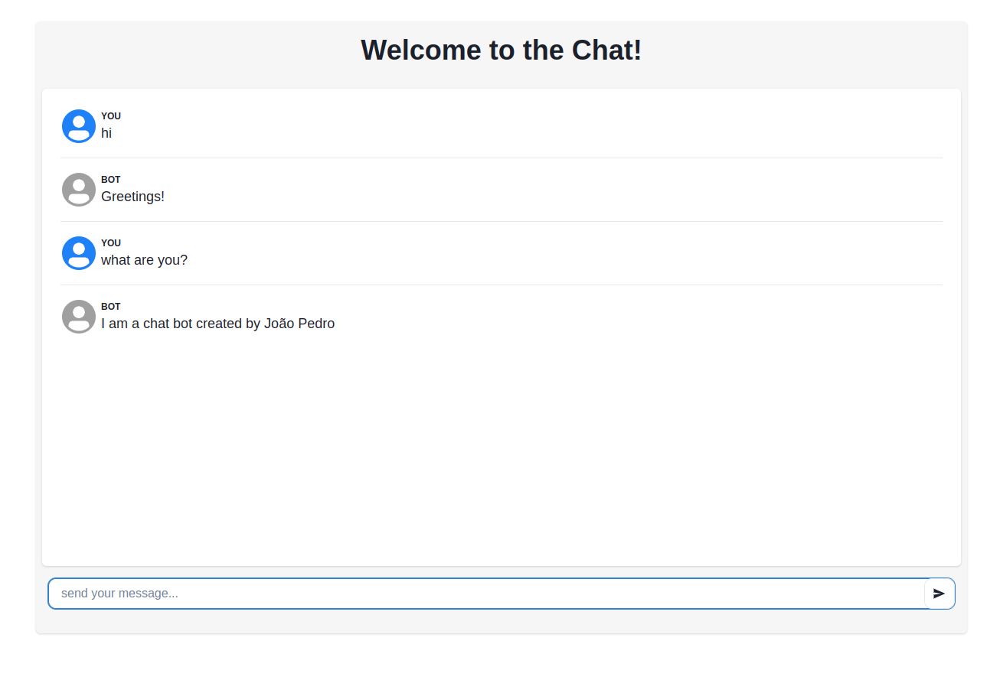

 

## Instructions to run project
### Docker + Docker Compose
- RUN `docker-compose up` in project root dir

### Node + Yarn
- install yarn and node (recommended version 18)

### Back-End (Chat-API)
In chat-api directory run:
- `yarn`
- `yarn nlp:train`
- `yarn build`
- `yarn start`

### Front-End (Chat-Web)
In chat-web directory run:
- `yarn`
- `yarn build`
- `yarn preview`

## Description
A simple chat bot based on the NLP.js library for natural language processing.

To client-server communication I used websockets, with Socket.io as library.
Some technologies and libraries I used: React.js, Vite, NodeJs, Socket.io, Nlp.js, inversify (dependency inversion).
